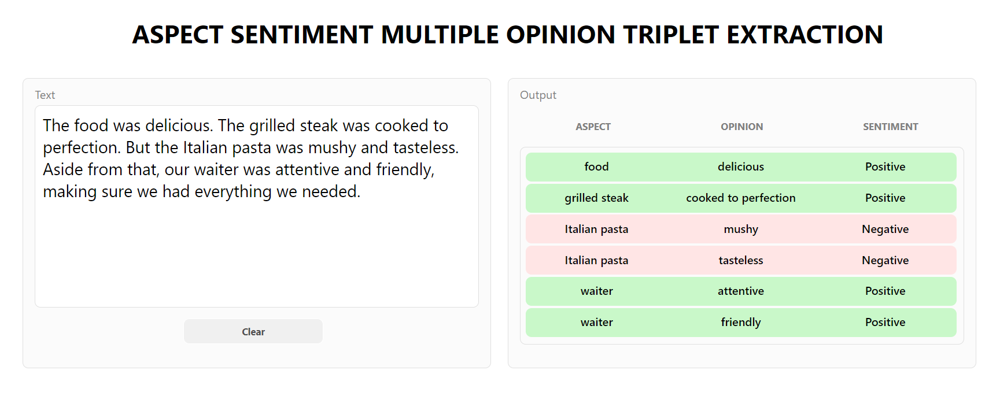
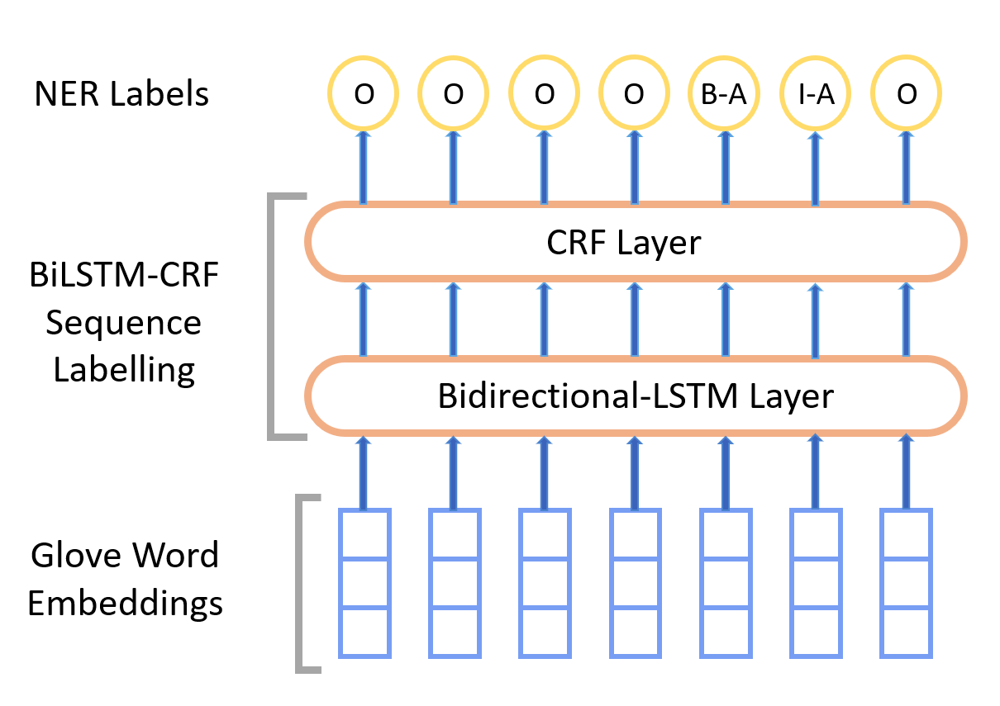
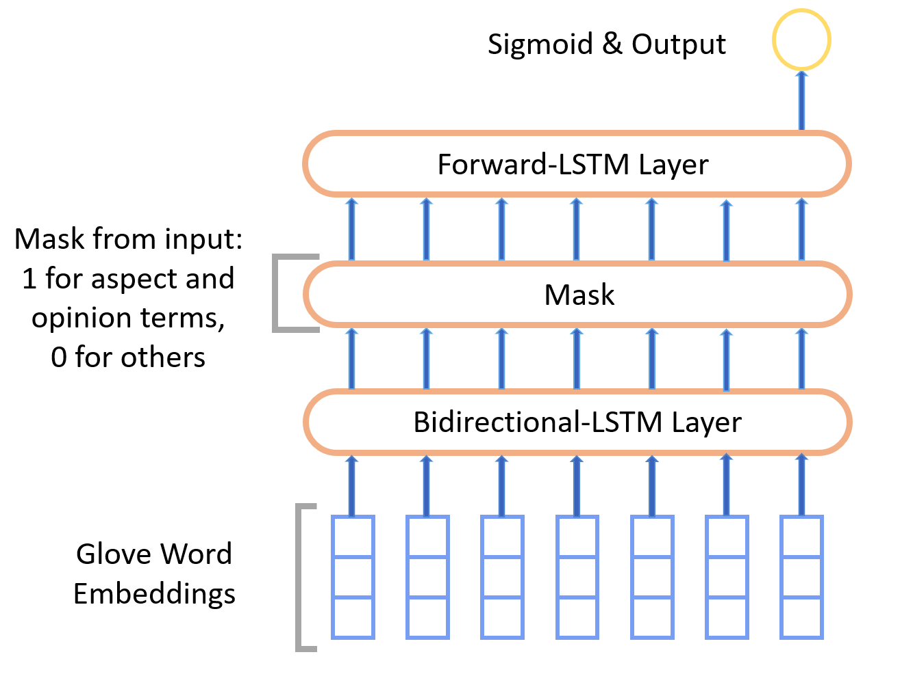
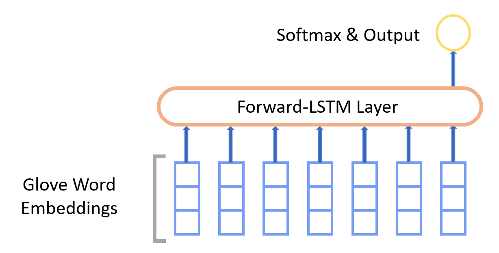

# ASMOTE

## Overview

**Aspect Sentiment Multiple Opinion Triplet Extraction (ASMOTE)** aims to find triplets that include aspects, sentiments, and various opinions. When the model extracts a triplet, it gives us a complete picture of all the opinions related to a specific aspect, helping us understand exactly why that aspect has a particular sentiment.

I utilized **TensorFlow 2** for its robust deep learning capabilities, enabling efficient development, training, and deployment of the sentiment analysis model. Additionally, **Flask** was chosen to showcase ASMOTE due to its lightweight, modular framework, ensuring an intuitive and user-friendly web interface.

Some challenges I faced included **extracting multi-word aspects and opinions**. To address this, I employed named entity recognition. Another challenge was **ensuring valid pairings of aspect and opinion**, which I tackled by training a dedicated classifier.

### Screenshot



Features I hope to implement in the future:

- **Implement an attention-based model or transformer model for aspect opinion extraction to improve accuracy over named entity recognition (NER)**
- **Manually augment sentences with negation and modifiers to handle negation and modifiers and increase accuracy over them.**

## Prerequisites

Ensure you have the following software installed:

- Python 3.8 or higher
- TensorFlow 2.0 or higher
- Flask 2.0 or higher

## Installation

1.  **Clone the Repository:**
    ```bash
    git clone https://github.com/Sajith17/ASMOTE.git
    cd your_project_directory
    ```
2.  **Create a Virtual Environment:**
    ```bash
    git clone https://github.com/Sajith17/ASMOTE.git
    cd ASMOTE/
    ```
3.  **Activate the Virtual Environment:**
    - On Windows:
      ```bash
      venv\Scripts\activate
      ```
    - On macOS/Linux:
      ```bash
      source venv/bin/activate
      ```
4.  **Install Dependencies:**
    ```bash
    pip install -r requirements.txt
    ```
5.  **Run the Application:**
    ```bash
    python app.py
    ```
6.  **Access the Website:**
    Open your web browser and navigate to `http://127.0.0.1:5000/` to explore the ASMOTE Flask website.

## Model Architecture

The Aspect Sentiment Multiple Opinion Triplet Extraction is divided into three subtasks:

- Extracting aspect and opinion terms
- Classifying positive pairs between aspects and opinions
- Predicting sentiment

The accompanying images illustrate the model architectures utilized for these subtasks

**Aspect And Opinion Term Extraction Model (NER)**



**Aspect Opinion Pair Classification Model**



**Sentiment Classification Model**


